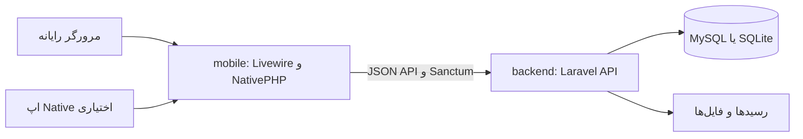

# سامانه مدیریت ساختمان

سامانه‌ای برای مدیریت ساختمان‌های مسکونی، واحدها، مالکین و ساکنین، شارژها، رسید پرداخت، هزینه‌ها، اطلاعیه‌ها و درخواست‌های ساکنین.

این مخزن از دو برنامه Laravel تشکیل شده است: `backend` سرویس API و پایگاه داده را فراهم می‌کند؛ `mobile` کلاینت Livewire/NativePHP است که هم در مرورگر رایانه قابل اجراست و هم می‌تواند به‌صورت اپ Native بسته‌بندی شود.

## قابلیت‌ها

- ورود و ثبت‌نام با شماره موبایل و احراز هویت مبتنی بر Laravel Sanctum
- نقش‌های مدیر سامانه، مدیر ساختمان، مالک و ساکن
- مدیریت ساختمان‌ها و واحدها
- نگهداری جداگانه مالک و ساکن هر واحد؛ یک مالک می‌تواند چند واحد داشته باشد
- ساخت حساب مالک و ساکن توسط مدیر و تخصیص آن‌ها به واحد
- ثبت شارژ و نمایش وضعیت پرداخت
- ارسال رسید پرداخت توسط مالک با فرمت JPG، PNG یا HEIC و حداکثر حجم ۱ مگابایت؛ مدیر می‌تواند رسید را ببیند و پرداخت را تأیید کند
- ثبت و پیگیری درخواست ساکن؛ ارسال اعلان برای مدیر همان ساختمان
- اطلاعیه‌ها، هزینه‌های ساختمان و گزارش خلاصه
- اعلان‌های درون‌برنامه‌ای؛ پشتیبانی Push در نسخه Native نیازمند تنظیم Firebase است
- رابط فارسی و راست‌چین

## معماری



حساب مالک و حساب ساکن دو نقش مستقل دارند. مالکیت با `apartments.owner_id` و سکونت با `apartments.resident_id` ثبت می‌شود. مدیر فقط اطلاعات و درخواست‌های ساختمان‌های تحت مدیریت خودش را می‌بیند.

## فناوری‌ها

- PHP 8.3 یا بالاتر و Composer
- Laravel 13 در بک‌اند و کلاینت
- Laravel Sanctum برای توکن‌های API
- Livewire 4 برای رابط کاربری
- NativePHP Mobile برای بسته‌بندی اپ Native (اختیاری)
- Node.js و npm برای ساخت assetهای رابط
- SQLite برای راه‌اندازی ساده محلی؛ MySQL نیز قابل استفاده است

## ساختار مخزن

```text
building-manager/
├── backend/   # REST API، احراز هویت، مدل‌ها، migrationها و منطق سامانه
└── mobile/    # رابط Livewire، اتصال API و پشتیبانی NativePHP
```

هر پوشه یک پروژه Laravel مستقل و `.env` جداگانه دارد. کلاینت اطلاعات اصلی ساختمان را از API می‌گیرد و پایگاه داده کلاینت برای نشست و داده‌های داخلی Laravel استفاده می‌شود.

## راه‌اندازی محلی در Windows

### پیش‌نیازها

- PHP 8.3+ با افزونه‌های موردنیاز Laravel و SQLite یا MySQL
- Composer
- Node.js و npm
- Git

برای تست در مرورگر رایانه، Android Studio لازم نیست.

### ۱. دریافت مخزن

```powershell
git clone <آدرس-مخزن-گیت‌هاب>
cd building-manager
```

### ۲. اجرای بک‌اند

در ترمینال اول:

```powershell
cd backend
Copy-Item .env.example .env
```

در `.env` مقدارهای `APP_URL` و اتصال دیتابیس را بررسی کنید. به‌صورت پیش‌فرض پروژه از SQLite استفاده می‌کند. اگر فایل دیتابیس هنوز وجود ندارد، بسازید:

```powershell
if (!(Test-Path database/database.sqlite)) {
    New-Item -ItemType File -Path database/database.sqlite | Out-Null
}
```

سپس:

```powershell
composer install
php artisan key:generate
php artisan migrate --seed
php artisan storage:link
php artisan serve --host=127.0.0.1 --port=8000
```

بک‌اند اکنون روی `http://127.0.0.1:8000` در دسترس است. مسیر سلامت سرویس `http://127.0.0.1:8000/up` است. اجرای `storage:link` برای نمایش رسیدهای بارگذاری‌شده لازم است.

### ۳. اجرای رابط وب/کلاینت

یک ترمینال دوم باز کنید:

```powershell
cd mobile
Copy-Item .env.example .env
```

در فایل `mobile/.env` آدرس API بک‌اند را تنظیم کنید:

```dotenv
APP_URL=http://127.0.0.1:3000
API_BASE_URL=http://127.0.0.1:8000/api
```

مقدار پیش‌فرض `API_BASE_URL` همین آدرس است. اگر SQLite انتخاب شده و فایل آن وجود ندارد، بسازید:

```powershell
if (!(Test-Path database/database.sqlite)) {
    New-Item -ItemType File -Path database/database.sqlite | Out-Null
}
```

سپس کلاینت را نصب و اجرا کنید:

```powershell
composer install
php artisan key:generate
npm install
npm run build
php artisan serve --host=127.0.0.1 --port=3000
```

صفحه را در مرورگر با نشانی `http://127.0.0.1:3000` باز کنید. برای مشاهده تغییرات assetها هنگام توسعه، به‌جای build نهایی می‌توانید در ترمینال دیگری از پوشه `mobile` دستور `npm run dev` را اجرا کنید.

### راه‌اندازی با MySQL

SQLite برای تست محلی آماده‌تر است. برای استفاده از MySQL، ابتدا یک دیتابیس خالی بسازید و مقدارهای زیر را در `backend/.env` قرار دهید:

```dotenv
DB_CONNECTION=mysql
DB_HOST=127.0.0.1
DB_PORT=3306
DB_DATABASE=building_manager
DB_USERNAME=نام_کاربری
DB_PASSWORD=رمز_دیتابیس
```

سپس از پوشه `backend` اجرا کنید:

```powershell
php artisan config:clear
php artisan migrate --seed
```

در محیط Native کلاینت، مقدار `API_BASE_URL` باید به آدرس قابل‌دسترسی بک‌اند اشاره کند. در Android Emulator معمولاً از `http://10.0.2.2:8000/api` استفاده می‌شود؛ برای گوشی واقعی، IP شبکه رایانه را قرار دهید و سرور را روی `0.0.0.0` اجرا کنید. مرورگر همان رایانه از `127.0.0.1` استفاده می‌کند.

## حساب‌های آزمایشی

با اجرای `php artisan migrate --seed` در بک‌اند، این حساب‌های آزمایشی ساخته می‌شوند:

| نقش | شماره موبایل | رمز |
|---|---|---|
| مدیر سامانه | `09120000001` | `123456` |
| مدیر ساختمان | `09120000002` | `123456` |
| ساکن نمونه | `09120000003` | `123456` |

این حساب‌ها صرفاً برای محیط محلی هستند؛ هرگز با این رمزها یا seed داده‌های آزمایشی را در سرویس عمومی/تولیدی اجرا نکنید. Seeder فقط حساب‌ها را می‌سازد و ساختمان یا واحد نمونه ایجاد نمی‌کند. برای امتحان کامل جریان ساکن، با حساب مدیر وارد شوید، ساختمان و واحد بسازید، از «مدیریت ساکنین» یک ساکن جدید ایجاد کنید و او را در فرم واحد به‌عنوان ساکن تخصیص دهید؛ سپس با حساب همان ساکن وارد شوید. برای ثبت درخواست، ساکن باید به واحدی تخصیص داده شده باشد.

## روندهای اصلی کار

### مدیر ساختمان

1. ساختمان و واحدها را ثبت می‌کند.
2. مالک و ساکن را از بخش‌های جداگانه می‌سازد.
3. در فرم واحد، مالک و ساکن را مستقل از هم انتخاب می‌کند.
4. شارژ، هزینه و اطلاعیه ثبت می‌کند؛ درخواست‌های ساکنین و رسیدهای پرداخت را بررسی می‌کند.

### مالک

شارژهای واحدهای تحت مالکیت خود را می‌بیند و رسید JPG/PNG/HEIC تا ۱ مگابایت می‌فرستد. رسید تا زمان بررسی مدیر به‌عنوان پرداخت تأییدشده ثبت نمی‌شود.

### ساکن

شارژها، اطلاعیه‌ها و هزینه‌های ساختمان را می‌بیند؛ درخواست ثبت می‌کند و پاسخ مدیر را پیگیری می‌کند. مدیر هنگام ثبت درخواست اعلان دریافت می‌کند.

## APIهای اصلی

پیشوند API به‌صورت پیش‌فرض `http://127.0.0.1:8000/api` است. مسیرهای زیر پس از احراز هویت با Sanctum در دسترس‌اند:

| مسیر | کاربرد |
|---|---|
| `POST /auth/login` و `POST /auth/register` | ورود و ثبت‌نام |
| `GET /auth/me` و `POST /auth/logout` | حساب فعلی و خروج |
| `GET /dashboard` | اطلاعات داشبورد بر اساس نقش |
| `/buildings` و `/buildings/{id}/apartments` | ساختمان‌ها و واحدها |
| `/owners` و `/residents` | فهرست‌گیری و ایجاد مالک/ساکن توسط مدیر |
| `/charges` و `/buildings/{id}/charges` | شارژهای شخصی و ساختمان |
| `POST /charges/{id}/receipt` | ارسال رسید توسط مالک |
| `POST /charges/{id}/approve-receipt` | تأیید رسید توسط مدیر ساختمان |
| `/requests` | ثبت، مشاهده و پاسخ به درخواست‌ها |
| `/notifications` | اعلان‌های کاربر |
| `/buildings/{id}/expenses` و `/buildings/{id}/announcements` | هزینه‌ها و اطلاعیه‌های ساختمان |

خطاهای API در قالب JSON و با وضعیت‌های HTTP استاندارد برگردانده می‌شوند.

## تست و ساخت

تست‌های بک‌اند:

```powershell
cd backend
php artisan test
```

تست‌های کلاینت:

```powershell
cd mobile
php artisan test
```

ساخت assetهای کلاینت:

```powershell
cd mobile
npm run build
```

## ساخت اپ Android (اختیاری)

برای اجرای مرورگری به Android Studio نیاز نیست. برای ساخت اپ Native، Android Studio، Android SDK و ابزارهای NativePHP را نصب و مسیر API را متناسب با Emulator یا گوشی تنظیم کنید؛ سپس از پوشه `mobile`:

```powershell
php artisan native:install android
php artisan native:run android
```

تنظیم اعلان Push به Firebase و مقادیر لازم آن نیاز دارد. بدون این تنظیم، اعلان‌های درون‌برنامه‌ای همچنان قابل استفاده‌اند.

## نکات GitHub و استقرار

- فایل‌های `.env`، کلید `APP_KEY`، رمز دیتابیس، توکن‌ها و اطلاعات واقعی را commit نکنید؛ فقط از `.env.example` برای مستندسازی متغیرها استفاده کنید.
- فایل‌های SQLite محلی، رسیدهای واقعی و محتویات `storage` را در مخزن عمومی قرار ندهید.
- قبل از استقرار، رمز حساب‌های seed را حذف/تغییر دهید، `APP_DEBUG=false` تنظیم کنید و از HTTPS استفاده کنید.
- برای محیط تولید، تنظیمات دیتابیس، نگهداری فایل‌ها، بکاپ و مجوز دسترسی به رسیدها را متناسب با زیرساخت خود تعیین کنید.

## عیب‌یابی سریع

- خطای اتصال کلاینت: مطمئن شوید بک‌اند روی پورت ۸۰۰۰ اجراست و `API_BASE_URL` در `mobile/.env` درست است.
- ورود موفق است ولی درخواست ساکن ثبت نمی‌شود: حساب ساکن باید در فرم واحد به‌عنوان «ساکن واحد» تخصیص یافته باشد.
- تصویر رسید باز نمی‌شود: از بک‌اند `php artisan storage:link` را اجرا کنید و دسترسی وب‌سرور به `storage/app/public` را بررسی کنید.
- فایل‌های CSS یا JavaScript به‌روز نیستند: از پوشه `mobile` دستور `npm run build` را اجرا کنید یا Vite dev server را بالا بیاورید.
- تنظیم‌های `.env` اثر نکرده‌اند: از همان پروژه دستور `php artisan config:clear` را اجرا و سرور را دوباره راه‌اندازی کنید.
